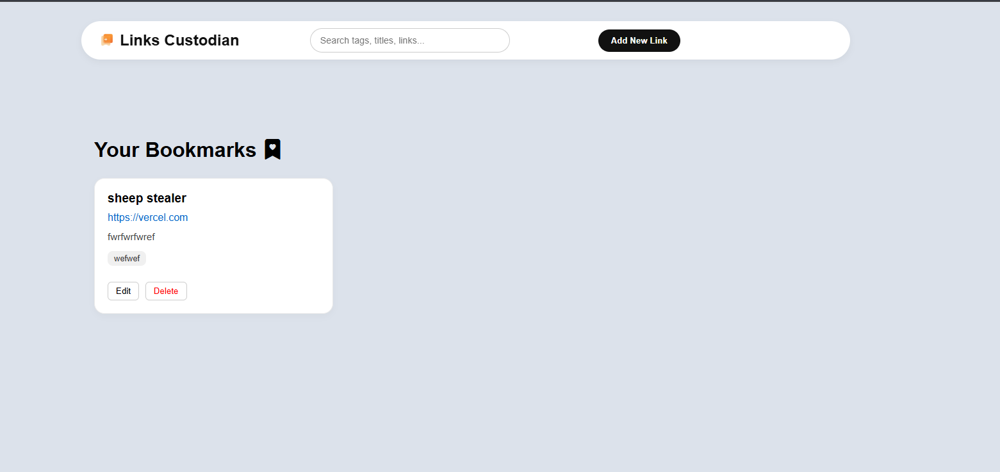

# Links Custodian Vault

A modern and responsive React application for saving, organizing, and managing your favorite web links and resources.

Built with React, TypeScript, and CSS Modules, the application allows users to add, edit, search, and delete saved links while automatically storing data directly in the browser using Local Storage.

## Preview



## Features

- **Add new links** with titles, URLs, descriptions, and tags.
- **Edit existing links** to update their details.
- **Delete links** with a built-in confirmation modal to prevent accidental deletion.
- **Search your vault** dynamically by:
  - Title
  - URL
  - Description
  - Tags
- **Organize bookmarks** using custom tags.
- **Persistent storage** using the browser's Local Storage API.
- **Custom Notifications** (toast messages) for successful saves, edits, and deletions.
- **Smart Empty States** that guide the user when the vault is empty or when a search yields no results.
- **Fully responsive design** that adapts seamlessly from mobile phones to large desktop screens.

## Technologies Used

- React
- TypeScript
- CSS Modules
- Vite
- Bootstrap Icons
- Local Storage API

## Responsive Design

The application layout shifts dynamically to ensure a great user experience across multiple screen sizes:

| Device       | Width   |
| :----------- | :------ |
| Mobile       | 320px   |
| Large Mobile | 480px   |
| Tablet       | 768px   |
| Laptop       | 1024px  |
| Desktop      | 1200px+ |

## Usage

1. Click **Add New Link** in the navigation bar or empty state.
2. Enter the following details:
   - Title
   - Link (URL)
   - Description
   - Tags (Optional)
3. Click **Save to Vault** to store the link.
4. Use the **Search bar** at the top to filter through your saved links instantly.
5. Click **Edit** or **Delete** on any link card to manage your existing bookmarks.

## Data Storage

All links are stored locally in your browser using the Local Storage API under the key `vaultLinks`. No external backend, database, or sign-up is required to use the application.

## Future Improvements

- Favorite/Pin specific links
- Categorized folders
- Dark mode support
- Import / Export links functionality
- Sorting options (by date added, alphabetical, etc.)
- Automatic website favicon fetching

## Deployed on Vercel

- [Live Application](https://links-vault-nine.vercel.app/)

## How to Run the Project Locally

1. **Clone the repository:** Open your terminal and run the following Git command to clone the project to your local machine:

```bash
   https://github.com/Omphile-coder/links-vault.git
```

1. **Navigate to the project directory:**

   ```bash
   cd Links-Custodian-Vault
   ```

2. **Open the project in your editor:**
   - Open Visual Studio Code.
   - You can also type `code .` in your terminal to open it directly in VS Code.

3. **Install dependencies:**
   Open the integrated VS Code terminal and run the following command to download the required packages:

   ```bash
   npm install
   ```

4. **Start the development server:**
   Once the installation is complete, start the app by running:
   ```bash
   npm run dev
   ```

## Author

**Omphile Lucas**

- GitHub: [@Omphile-coder](https://github.com/Omphile-coder)
